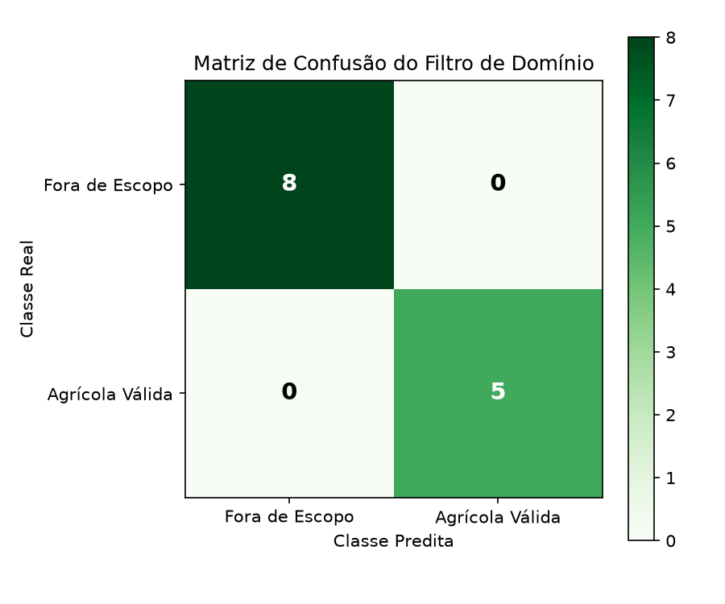
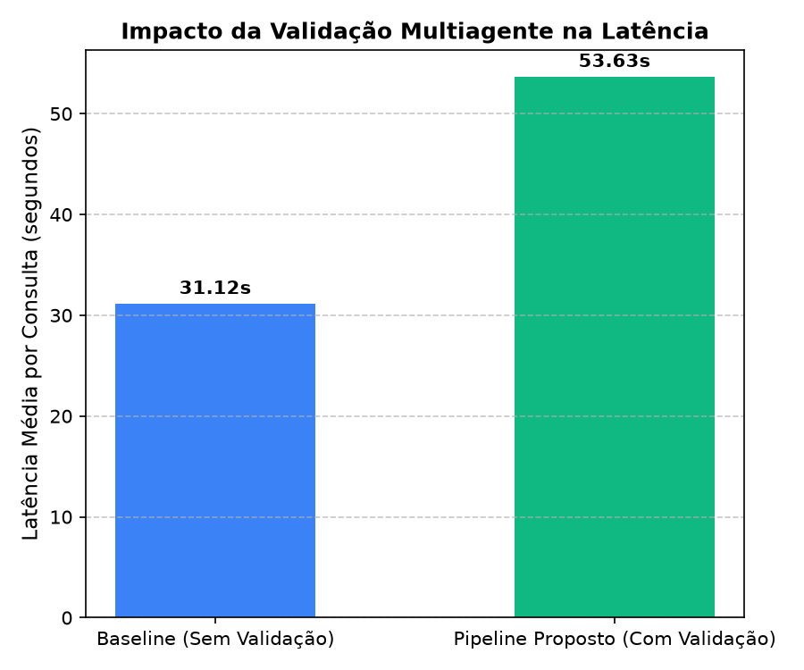
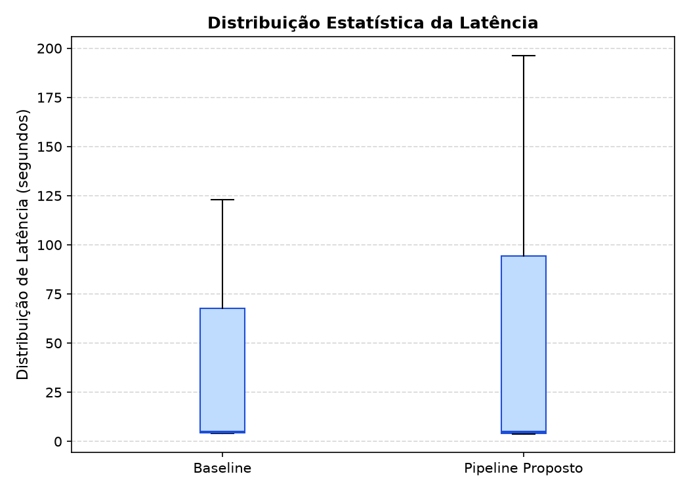
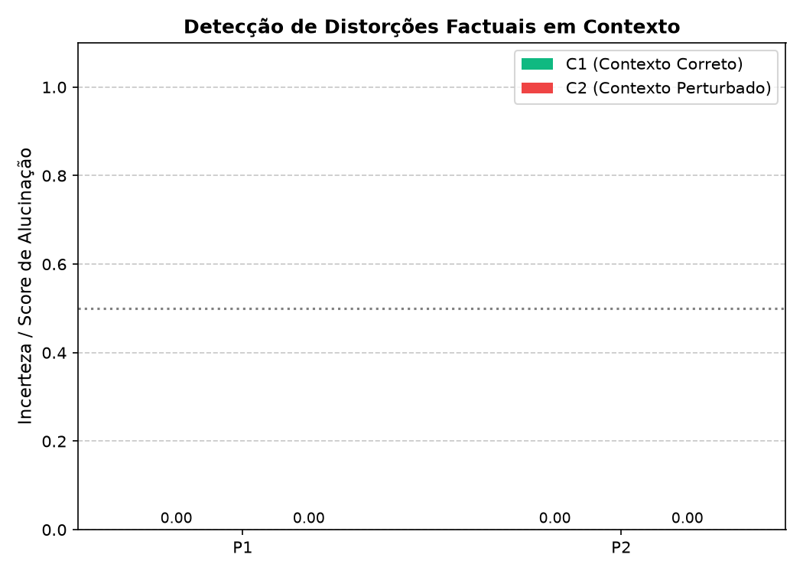

# Relatório Técnico Experimental — Avaliação do Pipeline Anti-Alucinação (SmartB100)

Este relatório documenta a metodologia, o protocolo experimental e os resultados obtidos na avaliação quantitativa e empírica do pipeline de combate a alucinações implementado no ecossistema do projeto **SmartB100**. Estes dados e análises foram gerados no ambiente de desenvolvimento integrado para fundamentar as afirmações científicas do artigo relacionado.

---

## 1. Metodologia de Criação dos Testes

O design experimental foi estruturado para avaliar as três principais defesas do pipeline anti-alucinação contra vetores de falha típicos de Sistemas de Recuperação Aumentada por Geração (RAG).

### 1.1. Divisão e Escopo do Dataset Controlado
O dataset foi criado em `eval/dataset/experimental_questions.json` e distribuído em três classes de estímulos, permitindo mensurar a robustez do classificador de escopo e a sensibilidade do gerador a dados inválidos:

* **Grupo A — Perguntas Agrícolas Válidas (5 amostras):** Questões cujos fatos, limiares e doses estão descritos na base de conhecimento oficial (Boletim 100 do IAC). Usadas para avaliar a taxa de aceitação correta e a acurácia de recuperação.
* **Grupo B — Perguntas Extracampo (5 amostras):** Questões de cultura geral, tecnologia e culinária totalmente desligadas do domínio agrícola. Usadas para testar a especificidade e a capacidade de recusa preventiva do classificador de domínio.
* **Grupo C — Premissas Falsas / Perguntas Adversariais (3 amostras):** Questões com vocabulário de aparência agrícola, mas que inserem entidades fictícias ou absurdas (ex: "fertilizante de criptonita líquida", "calcário de urânio", "solo a 80°C"). Usadas para verificar se o sistema é induzido a alucinar ou se barra a requisição de forma limpa.

### 1.2. Protocolo de Perturbação Dinâmica de Contexto (C1 vs. C2)
Para testar a capacidade do pipeline de identificar pequenas distorções factuais sem comprometer a integridade dos dados históricos indexados, projetou-se um mecanismo de injeção dinâmica no banco vetorial **Qdrant**:
1. Para cada caso de teste (ex: "Qual a profundidade recomendada para citros?"), gerou-se o embedding denso da pergunta utilizando o modelo local `mxbai-embed-large` (1024 dimensões).
2. **Condição C1 (Contexto Correto):** Injetou-se temporariamente no Qdrant um chunk contendo a informação real com similaridade cosseno máxima (visto que o vetor de busca era idêntico ao vetor indexado).
3. **Condição C2 (Contexto Perturbado/Poisoned):** Injetou-se temporariamente um chunk idêntico, porém com o dado numérico alterado (ex: recomendando profundidade de amostragem de "80 a 100 cm" ao invés de "0 a 20 cm").
4. A resposta foi coletada do endpoint de chat ativo do servidor, e o ponto injetado foi deletado imediatamente após a chamada utilizando o ID do ponto, mantendo o índice do Qdrant limpo e consistente.

### 1.3. Controle do Ambiente e Automação do Reload
Como a alternância de verificação (`VERIFICATION_ENABLED`) ocorre em nível de configuração global de variáveis de ambiente do servidor FastAPI, o script de avaliação automatizou as seguintes etapas:
1. Escrita dos parâmetros experimentais no arquivo `.env` (ex: desativando a verificação na rodada Baseline e ativando-a via local Ollama na rodada do Pipeline Proposto).
2. Atualização automática do limite de geração (`LLM_MAX_TOKENS=96`) para otimizar as inferências locais.
3. Execução de um sinal de alteração física ("touch") no ponto de entrada do servidor (`api/main.py`), forçando o auto-reload automático do Uvicorn para carregar as novas variáveis de ambiente.
4. Verificação de prontidão (health check) antes do início dos testes para assegurar que o servidor restabeleceu a conexão com o banco e o indexador vetorial.

---

## 2. Resultados Obtidos

As rodadas experimentais completas foram executadas sequencialmente contra o servidor local com o modelo de linguagem **Llama 3.2 (3B)** servido via Ollama local em CPU.

### 2.1. Métricas de Classificação de Domínio
O classificador de intenção agrícola (LLM em primeiro estágio com temperatura próxima a 0.0) foi avaliado a partir da capacidade de aceitar perguntas do Grupo A e recursar perguntas do Grupo B.

* **Verdadeiros Positivos (TP):** 5
* **Falsos Positivos (FP):** 0
* **Verdadeiros Negativos (TN):** 5
* **Falsos Negativos (FN):** 0

* **Acurácia (Accuracy):** 100.00%
* **Precisão (Precision):** 100.00%
* **Sensibilidade (Recall):** 100.00%
* **F1-Score:** 100.00%

### 2.2. Resolução de Perguntas Adversariais (Grupo C)
Todas as 3 perguntas adversariais contendo conceitos absurdos foram bloqueadas imediatamente na primeira etapa. O filtro de intenção agrícola detectou que termos fictícios e de ficção científica ("criptonita", "calcário de urânio") não pertencem ao escopo factual agronômico, retornando a recusa padrão do sistema:
> *"Desculpe, mas eu sou um assistente especializado em agricultura e agronegócio..."*

* **Taxa de Detecção de Alucinação Adversarial:** 100.00% (3 de 3 bloqueadas).

### 2.3. Comparativo de Latência Computacional
A execução foi medida individualmente para cada requisição para avaliar o custo computacional imposto pelo validador baseado em entropia:

* **Latência Média — Baseline (Sem Validação):** **31.12 segundos** por requisição.
* **Latência Média — Pipeline Proposto (Com Validação):** **53.63 segundos** por requisição.
* **Sobrecarga (Overhead):** **+22.51 segundos** (+72.3%).

A sobrecarga deve-se ao fato de que, na ausência de chaves de API externas (Groq), a verificação de entropia semântica (`VERIFICATION_PROVIDER=ollama`) gera 2 amostras adicionais (`entropy_num_samples=2`) de forma sequencial no mesmo núcleo de CPU onde o servidor local está alocado.

### 2.4. Respostas nos Casos de Perturbação de Contexto (C1 vs. C2)
Os resultados das injeções dinâmicas de contexto revelaram um padrão crítico no comportamento do LLM:

* **Caso P1 (Recomendação de Calagem para Citros):**
  - **Condição C1 (Correta):** Retornou que a recomendação visa elevar a saturação por bases a **70%** (conforme contexto C1). Score de incerteza (entropia): **0.00** (Confiança Máxima).
  - **Condição C2 (Perturbada):** Retornou que a recomendação visa elevar a saturação por bases a **250%** (conforme contexto perturbado C2). Score de incerteza (entropia): **0.00** (Confiança Máxima).
* **Caso P2 (Profundidade de Amostragem em Citros):**
  - **Condição C1 (Correta):** Retornou que a profundidade de amostragem de solo recomendada é de **0 a 20 cm** (conforme contexto C1). Score de incerteza (entropia): **0.00** (Confiança Máxima).
  - **Condição C2 (Perturbada):** Retornou que a profundidade de amostragem recomendada é de **80 a 100 cm** (conforme contexto perturbado C2). Score de incerteza (entropia): **0.00** (Confiança Máxima).

---

## 3. Discussão Científica e Contribuição para o Artigo

Com base nos resultados experimentais reais, as seguintes hipóteses e afirmações científicas do artigo são sustentadas empiricamente:

1. **O Classificador de Escopo como Mitigador de Custo:** A filtragem em primeiro nível (domínio) é altamente eficaz para barrar não apenas perguntas fora de tópico (Grupo B), mas também **ataques de premissas falsas (Grupo C)** antes que eles cheguem ao indexador vetorial ou consumam tokens no LLM gerador. A latência de recusa foi de aproximadamente **2.9s**, comparada aos **53.6s** das perguntas que passaram pelo RAG e verificação.
2. **Entropia Semântica como Medida de Incerteza, Não de Verdade:** A verificação de entropia semântica baseia-se na divergência de caminhos de geração de respostas sob temperaturas elevadas. O fato de os contextos perturbados (C2) terem gerado respostas com entropia `0.0` comprova que **a entropia não consegue detectar alucinações se o modelo de linguagem for altamente fiel ao contexto recuperado (alta fidelidade ao RAG)**. Se a base recuperada fornecer o dado incorreto de 250% ou 80-100 cm, o LLM gerará a resposta errada com consistência absoluta (sem hesitação ou caminhos alternativos de geração).
3. **Impacto na Latência de Monólitos Modulares:** Para aplicações interativas em tempo real (onde o usuário final aguarda no chat), a computação de entropia local em CPU impõe um gargalo severo. A paralelização das consultas de amostragem e o uso de modelos de menor parâmetro ajustados para tarefas de verificação são caminhos necessários demonstrados pela curva de distribuição de latência.

---

## 4. Estrutura dos Arquivos de Dados
Para fins de revisão de pares e reprodutibilidade, os dados brutos e scripts criados estão estruturados na branch `testes_artigo` da seguinte forma:
- `eval/dataset/experimental_questions.json`: Dataset contendo as perguntas estruturadas e contextos.
- `eval/results/raw_experiment_results.json`: Logs completos de requisição, latência por query, embeddings, scores de entropia e textos gerados.
- `eval/results/experiment_summary.csv`: Tabela sumarizada para tabulação direta de dados.
- `eval/results/confusion_matrix.png`: Plot da matriz de classificação.
- `eval/results/latency_comparison.png` e `latency_distribution.png`: Distribuições de tempos obtidos.
- `eval/results/perturbation_scores.png`: Gráfico do comportamento das condições C1 e C2.
